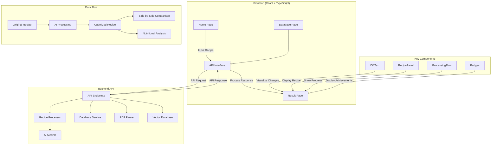

# Recipe Optimizer Architecture

Below is a diagram illustrating the Recipe Optimizer application architecture and data flow.

## Data Flow Explanation

1. **User Input**: Users input their recipe text and optimization goal on the Home page
2. **API Request**: The frontend sends the data to the backend via the API interface
3. **AI Processing**: The backend processes the recipe using AI models
4. **Database Storage**: The original recipe, goal, and results are stored in the database
5. **Vector Embeddings**: Recipe data may be stored as vector embeddings for similarity searches
6. **Result Display**: The optimized recipe is displayed alongside the original with differences highlighted
7. **Performance Metrics**: Processing times and token usage are tracked and displayed

This architecture supports both synchronous recipe processing and asynchronous database operations, providing users with an immediate feedback loop while maintaining a history of their optimizations. 